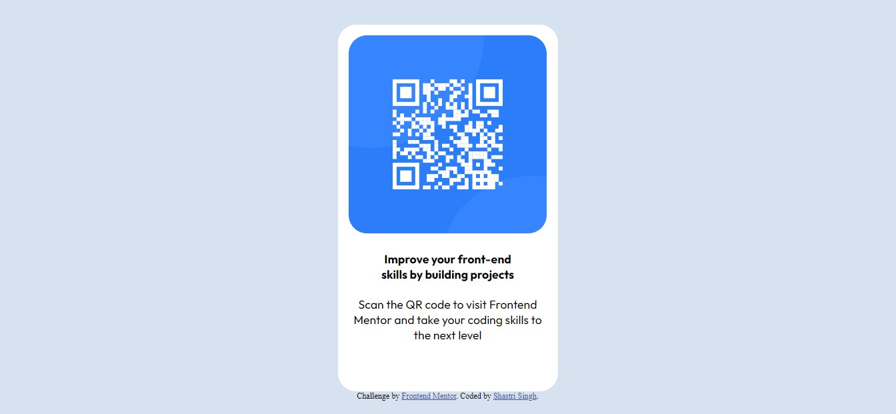

# Frontend Mentor - QR code component solution

This is a solution to the [QR code component challenge on Frontend Mentor](https://www.frontendmentor.io/challenges/qr-code-component-iux_sIO_H). Frontend Mentor challenges help you improve your coding skills by building realistic projects. 

## Table of contents

- [Overview](#overview)
  - [Screenshot](#screenshot)
  - [Links](#links)
- [My process](#my-process)
  - [Built with](#built-with)
  - [What I learned](#what-i-learned)
  - [Continued development](#continued-development)
  - [Useful resources](#useful-resources)
- [Author](#author)
- [Acknowledgments](#acknowledgments)


## Overview

### Screenshot




### Links

- Solution URL: [https://github.com/shastri-singh/qr-code-component](https://github.com/shastri-singh/qr-code-component)
- Live Site URL: [https://qr-code-component-ddb.pages.dev](https://qr-code-component-ddb.pages.dev/)

## My process

### Built with

- HTML5
- CSS3


### What I learned

Recapping over a few things I learned while working through this project. See code samples of areas below.

Code snippets, see below:


```css
/* div container for QR code image */
.container {
    background-color: white;
    height: 450px;
    width: 300px;
    border-radius: 25px;
    margin: 100px auto 100px auto;
}


/* QR code styling */
.qr-code-image {
    width: 90%;
    margin-top: 15px;
    margin-left: auto;
    margin-right: auto;
    border-radius: 25px;
}
```

Suggestions from @ecemgo, that was commented out and to add, see below:
```css
body {
    background-color: #d6e2f0;
    /*  
    Remove:
    text-align: center; 
    */
    /* Add the following: */
    display:  flex;
    flex-direction: column;
    justify-content: center;
    align-items: center;
    min-height: 100vh;

}

/* div container for QR code image */
.container {
    background-color: white;
    height: 500px;
    width: 300px;
    border-radius: 25px;
    /* 
    Remove:
    margin: 100px auto; 
    */
}

/* Footer */
.attribution { 
    font-size: 11px; 
    text-align: center;
    /* 
    Remove:
    margin-top: 300px;
    */
}
```

Minor tweeks after making the suggested changes, see below:
```css
.qr-code-image {
    width: 90%;
    align-items: center;
    margin-top: 15px;
    margin-left: 15px; /* removed auto and used 15px */
    margin-right: 15px; /* removed auto and used 15px */
    border-radius: 25px;
}
```


If you want more help with writing markdown, we'd recommend checking out [The Markdown Guide](https://www.markdownguide.org/) to learn more.


### Continued development

Currently Learning:
- HTML5
- CSS3 - 

Languages To Learn:
- Javascript
- Typescript
- SQL
- iQuery
- Next.js

Frameworks To Learn:
- Bootstrap
- Tailwind CSS
- Laravel

Library To Learn:
- React


### Useful resources

- [HSL to HEX | Html Colors](https://htmlcolors.com/hsl-to-hex) - TThis was used to convert Hsl values to Hex.
- [HTML Center Image – CSS Align Img Center Example](https://www.freecodecamp.org/news/html-center-image-css-align-img-center-example/amp/#howtocenteranimagewithflexbox) - This helped me centre images in CSS.
- [CSS Rounded Cornerss](https://www.w3schools.com/css/css3_borders.asp) - This helped me understand how to use border-radius to round corders for images and div containers.


## Author

- Website - [Shastri Singh](https://www.shastrisingh.com)
- Frontend Mentor - [@Aizen-senpai](https://www.frontendmentor.io/profile/Aizen-senpai)


## Acknowledgments

I would like to thank [@ecemgo](https://www.frontendmentor.io/profile/ecemgo) for taking the time to review and make suggestions to my CSS code, which worked together with a minor changes from myself.
